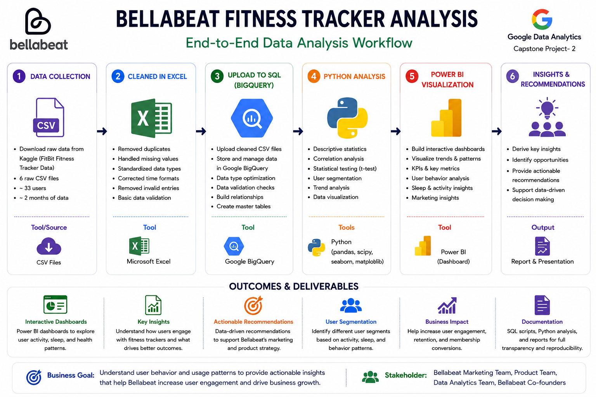
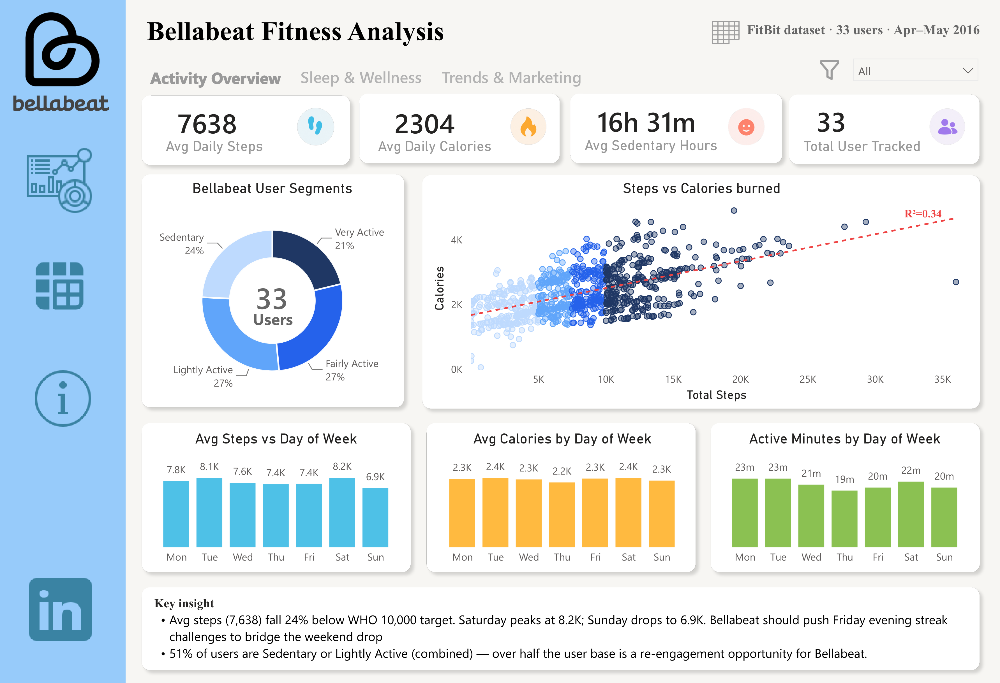
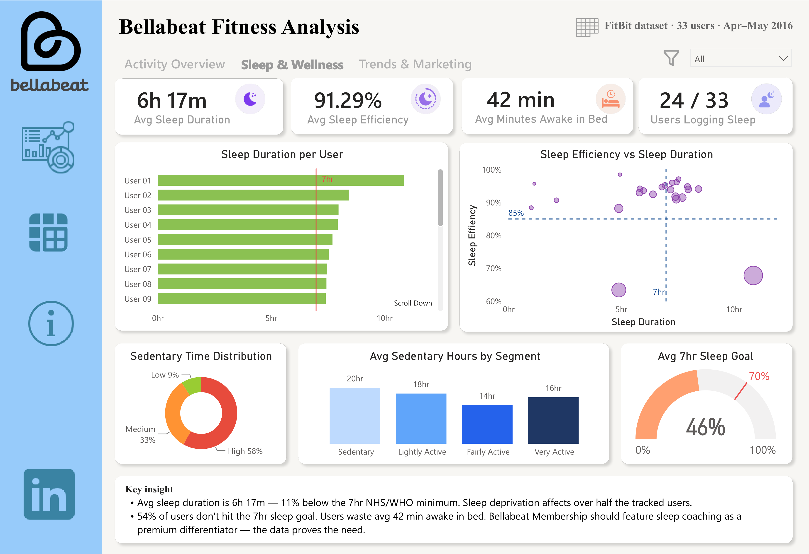
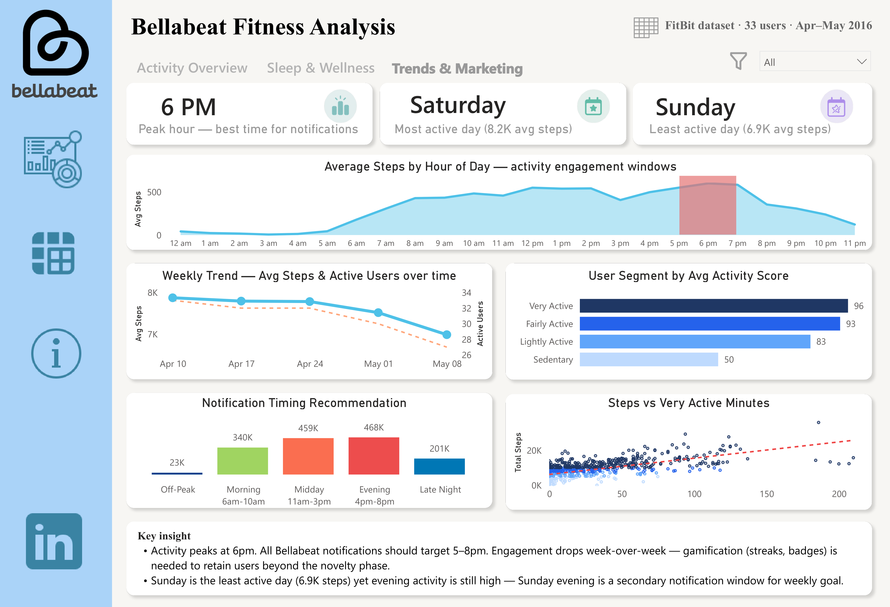

# 💓 Bellabeat Fitness Tracker Analysis

**End-to-end analytics case study** — turning 33 users' worth of FitBit tracker data into product and marketing recommendations for Bellabeat, a high-tech wellness company for women.

</p>

<p align="center">


</p>

---

# 👨‍💻 Author

**Brojo Mohan Dutta**

**Google Data Analytics Professional Certificate**

**Capstone Project 2**

---

# 📌 Project Overview

This end-to-end data analytics project analyzes Fitbit smart device usage data to understand user behavior and provide data-driven marketing recommendations for Bellabeat, a health-focused technology company for women.

Using **Google BigQuery**, **SQL**, **Python**, and **Power BI**, the project transforms raw fitness tracking data into actionable business insights through data cleaning, statistical analysis, user segmentation, and interactive dashboards.

---

# 🎯 Business Problem

Bellabeat wants to better understand how consumers use smart fitness devices.

The primary business question is:

> **How do consumers use smart fitness devices, and how can these insights support Bellabeat's marketing strategy and product growth?**

---

# 📊 Project Summary

| Category | Details |
|-----------|---------|
| Project | Bellabeat Fitness Tracker Analysis |
| Author | Brojo Mohan Dutta |
| Course | Google Data Analytics Professional Certificate |
| Case Study | Capstone Project 2 |
| Dataset | Fitbit Fitness Tracker Dataset (Kaggle) |
| Users Analyzed | **33 Fitbit Users** |
| Time Period | **~2 Months** |
| Source Tables | **6 Cleaned Tables** |
| Tools | Google BigQuery, SQL, Python, Google Colab, Power BI |
| Dashboard | Interactive Power BI Dashboard |
| Project Type | End-to-End Data Analytics |

---

# 🛠 Technology Stack

| Tool | Purpose |
|------|---------|
| Google BigQuery | Cloud data warehouse & SQL processing |
| SQL | Data cleaning, transformation & analysis |
| Python (Pandas, NumPy, SciPy, Matplotlib) | Statistical analysis & visualization |
| Google Colab | Python development environment |
| Power BI | Interactive dashboards & business storytelling |
| Microsoft Excel | Initial data cleaning & validation |

---

# 🔄 Project Workflow

<p align="center">

</p>

The project followed this analytical workflow:

1. Download Fitbit dataset from Kaggle
2. Clean raw CSV files using Microsoft Excel
3. Upload cleaned files into Google BigQuery
4. Transform and integrate data using SQL
5. Perform statistical analysis in Python
6. Build interactive Power BI dashboards
7. Generate business insights and recommendations

---

# 📂 Dataset Overview

The project uses six cleaned Fitbit datasets:

- Daily Activity
- Sleep Data
- Hourly Steps
- Hourly Intensities
- Heart Rate
- Weight Log

These datasets were integrated into a master analytical table for downstream analysis.

---

# 📈 Exploratory Data Analysis

Analysis includes:

- Descriptive Statistics
- Correlation Analysis
- Pearson Correlation
- Linear Regression
- Welch's t-Test
- User Segmentation
- Sleep Efficiency Analysis
- Activity Trend Analysis
- Heart Rate Analysis

---

# 📊 Dashboard Preview

## Executive Overview



---

## User Behavior Analysis



---

## Marketing Insights



---

# 📈 Key Findings

- Average daily steps are approximately **7,638**.
- Average daily calories burned are **2,304**.
- Around **30% of users** belong to sedentary or lightly active groups.
- Only **24 of 33 users** tracked sleep consistently.
- Only **8 users** recorded weight information.
- Daily steps show a strong positive relationship with calorie expenditure.
- Physical activity peaks during the **early evening hours**.
- Sleep efficiency is above **90%** for active sleep trackers.

---

# 💡 Business Recommendations

### 🥇 Encourage Evening Engagement

Schedule workout reminders and wellness notifications during peak activity hours.

---

### 🥈 Re-engage Sedentary Users

Create personalized movement challenges targeting users with fewer than 5,000 daily steps.

---

### 🥉 Expand Sleep Coaching

Promote Bellabeat's sleep monitoring and coaching features to improve long-term user engagement.

---

# 📂 Repository Structure

```text
Bellabeat-Fitness-Tracker-Analysis/

│── README.md
│── LICENSE
│── requirements.txt
│── .gitignore

├── 01_data
│   ├── sample_data
│   │   ├── daily_activities.csv
│   │   ├── heart_rate.csv
│   │   ├── hourly_intensities.csv
│   │   ├── hourly_steps.csv
│   │   ├── sleep_data.csv
│   │   └── weight_log.csv
│   │
│   ├── DATA_SOURCE.md
│   └── data_dictionary.md
│
├── 02_sql
│   ├── sql_queries
│   │   ├── 00_dataset_setup.sql
│   │   ├── 01_clean_daily_activity.sql
│   │   ├── 02_clean_sleep_data.sql
│   │   ├── 03_clean_hourly_steps.sql
│   │   ├── 04_clean_hourly_intensities.sql
│   │   ├── 05_clean_weight_log.sql
│   │   ├── 06_clean_heart_rate.sql
│   │   ├── 07_master_user_activity.sql
│   │   ├── 08_analysis_queries.sql
│   │   └── 09_export_tables.sql
│   │
│   ├── Bellabeat_SQL_Analysis_queries.docx
│   └── Bellabeat_SQL_Analysis_queries.pdf
│
├── 03_python
│   ├── visuals
│   │   ├── correlation_analysis.png
│   │   ├── dashboard_export_charts.png
│   │   ├── distribution_plots.png
│   │   ├── heart_rate_analysis.png
│   │   ├── sleep_analysis.png
│   │   ├── user_segmentation.png
│   │   └── weekly_trends.png
│   │
│   ├── Bellabeat_Colab_Python_Analysis.docx
│   ├── Bellabeat_Colab_Python_Analysis.pdf
│   ├── bellabeat_analysis.ipynb
│   └── bellabeat_analysis.py
│
├── 04_power_bi
│   ├── Bellabeat_Fitness_Analysis.pbix
│   ├── dashboard_1_activity_overview.png
│   ├── dashboard_2_sleep_wellness_trends.png
│   ├── dashboard_3_trends_marketing_insights.png
│   └── power_bi_publish_link.md
│
├── 05_presentation
│   ├── Bellabeat_Case_Study_Report.docx
│   ├── Bellabeat_Case_Study_Report.pdf
│   ├── case_study_brief.docx
│   ├── case_study_brief_Readme.md
│   ├── key_findings.md
│   └── workflow.png
```
---

# 📈 Power BI Dashboard

### Live Dashboard

👉 **Power BI Service**

*(Insert your Power BI published link here)*

---

# 📂 Dataset

**Source:** Fitbit Fitness Tracker Dataset (Kaggle)

https://www.kaggle.com/datasets/arashnic/fitbit

The raw data was cleaned in Microsoft Excel before being processed in Google BigQuery.

---

# 📄 Project Deliverables

✔ SQL Scripts

✔ Python Notebook

✔ Python Script

✔ Power BI Dashboard

✔ Business Report

✔ Executive Brief

✔ Documentation

---

# 📜 License

This project is licensed under the **MIT License**.

---

# ⭐ Support

If you found this project helpful, please consider giving this repository a ⭐.

Thank you for visiting!
